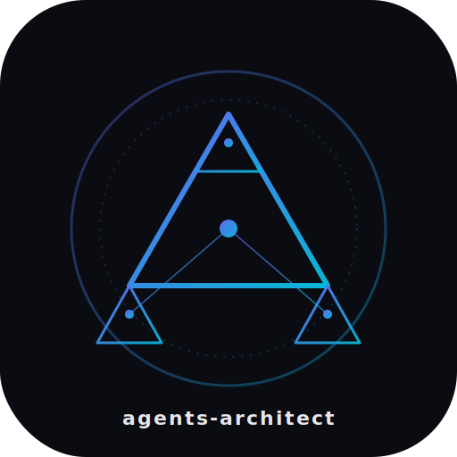

<p align="center">
  
</p>

<h1 align="center">agents-architect</h1>

<p align="center">
  <b>The Claude Code plugin that builds Claude Code plugins.</b><br/>
  A meta-agentic system that researches any domain, scouts the right MCPs, and scaffolds a full plugin — skills, sub-agents, slash commands, CLAUDE.md context layer, hooks, and marketplace entry — from one prompt.
</p>

<p align="center">
  <a href="#install"></a>
  
  
  
</p>

---

## TL;DR

```bash
claude plugin marketplace add Ibrahim-3d/agents-architect
claude plugin install agents-architect@agents-architect-marketplace
```

Then in Claude Code:

```
/agents-architect:new 3d-modeling --tool blender-python --name blender-arch
```

You get a fully-validated, installable plugin at `~/.claude/agents-architect-sessions/<ts>-blender-arch/dist/blender-arch-0.1.0.tar.gz`.

---

## Why

Every time you start a new agentic workflow — 3D modeling, cardiac pharmacokinetics, legal contract review, architectural renders — you re-do the same five steps by hand:

1. Research the domain (what do experts actually do, what tools exist, what's the SOTA).
2. Hunt for MCPs or libraries so you don't reinvent plumbing.
3. Write skills with good trigger phrases so Claude actually loads them.
4. Write sub-agents with tight tool allowlists so context doesn't explode.
5. Wire it all into a plugin with CLAUDE.md, hooks, and a marketplace entry.

**agents-architect does all of that in one command.** It's recursive — it built itself, it builds specialists, and those specialists can spawn their own specialists.

---

## What it builds for you

Given a domain prompt (e.g., *"3D modeling with Blender's Python API"*), it produces:

```
<domain>-arch/
├── .claude-plugin/
│   ├── plugin.json          # manifest: kebab-case name, SemVer, author, keywords
│   └── marketplace.json     # installable marketplace entry
├── skills/                  # progressive-disclosure skills with tuned triggers
│   ├── <domain-core>/SKILL.md
│   ├── <domain-workflow>/SKILL.md
│   └── context-management/SKILL.md
├── agents/                  # sub-agents with tight tool allowlists
│   ├── <domain>-researcher.md
│   ├── <domain>-author.md
│   └── <domain>-evaluator.md
├── commands/<domain>/       # slash commands with @-imports + $ARGUMENTS
│   ├── new.md
│   ├── iterate.md
│   └── compact.md
├── <domain>-arch/
│   ├── references/          # shared knowledge modules (cited, deduped)
│   └── templates/           # CLAUDE.md, state.json, etc.
├── hooks/hooks.json         # SessionStart + PreCompact
├── scripts/
│   ├── validate.py          # structural lint (runs in CI)
│   └── install.sh
├── CHANGELOG.md · LICENSE · README.md
└── dist/<domain>-arch-0.1.0.tar.gz
```

---

## How it works

**one command → eight sub-agents → one installable plugin**

```
/agents-architect:new <domain> [--tool X] [--mcp Y]
         │
         ▼
┌─────────────────────────────────────────────────────────┐
│                   orchestrator                          │
│   (/agents-architect:new — routes and checkpoints)      │
└──────────┬──────────────────────────────────────────────┘
           │
   ┌───────┼──────────┬──────────┬──────────┬──────────┐
   ▼       ▼          ▼          ▼          ▼          ▼
domain-  mcp-      skill-     agent-    command-   context-
research scout     author     author    author     architect
   │       │          │          │          │          │
   └───────┴────┬─────┴──────────┴──────────┴──────────┘
                ▼
          plugin-packager → evaluator → dist/*.tar.gz
```

Every sub-agent has a tight tool allowlist and a single-artifact contract. State is checkpointed to `~/.claude/agents-architect-sessions/<ts>-<plugin-name>/STATE.md` so long sessions survive `/compact`.

---

## Key design choices

- **Progressive disclosure everywhere.** Skills are metadata + references, not 2000-line monoliths. They load lazily via `@`-imports so context stays cheap.
- **Orchestrator ↔ specialist pattern.** The slash command is the orchestrator; agents are specialists with narrow contracts. No agent calls another agent without routing through the orchestrator.
- **Tight tool allowlists.** Every sub-agent declares only the tools it needs. MCP scout gets web. Skill author gets `Read/Write/Glob`. Evaluator gets `Read`, `Bash`, `Glob`, `Grep`.
- **Context as a first-class citizen.** Four-tier degradation (PEAK 0–30% / GOOD 30–50% / DEGRADING 50–70% / POOR 70%+), read-depth rules by context window size, STATE.md checkpoints before `/compact`. See [`skills/context-management/SKILL.md`](./skills/context-management/SKILL.md).
- **Forbidden-key enforcement.** Agents in plugins can't declare `hooks`, `mcpServers`, or `permissionMode` — the packager strips them and the validator fails the build.
- **Recursive.** To add a new authoring skill (say, for authoring MCP servers), run `/agents-architect:new mcp-server-authoring` inside agents-architect itself.

---

## Install

### From GitHub

```bash
claude plugin marketplace add Ibrahim-3d/agents-architect
claude plugin install agents-architect@agents-architect-marketplace
```

### From tarball

```bash
tar -xzf agents-architect-0.1.0.tar.gz -C ~/.claude/plugins/
```

### Development (clone + symlink)

```bash
git clone https://github.com/Ibrahim-3d/agents-architect ~/.claude/plugins/agents-architect
python3 ~/.claude/plugins/agents-architect/scripts/validate.py ~/.claude/plugins/agents-architect
```

---

## Commands

| Command | Purpose |
|---|---|
| `/agents-architect:new <domain>` | Full build — research → scout → scaffold → evaluate → package |
| `/agents-architect:research <domain>` | Domain-research pass only (produces `DOMAIN.md` + `MCP_PLAN.md`) |
| `/agents-architect:skill <name>` | Author a single skill into the current session |
| `/agents-architect:agent <name>` | Author a single sub-agent |
| `/agents-architect:command <name>` | Author a single slash command |
| `/agents-architect:plugin` | Package + validate current session as a plugin |
| `/agents-architect:iterate` | Re-run evaluator, apply fixes, bump version |
| `/agents-architect:compact` | Checkpoint STATE.md, prune context, resume |
| `/agents-architect:install <name>` | Install a session-produced plugin locally |

---

## Compatibility

Plays well with other Claude Code plugins. Namespace-isolated: all commands `/agents-architect:*`, all agents prefixed `arch-*`, no hook-name collisions.

Known-good alongside:
- [`orchestrator-supaconductor`](https://github.com/Ibrahim-3d/orchestrator-supaconductor) — Claude Code as a full eng team
- `nano-banana` image-gen plugin

---

## Project layout

```
agents-architect/
├── .claude-plugin/          # plugin.json + marketplace.json
├── agents/                  # 8 meta-authoring sub-agents (arch-*)
├── commands/agents-architect/
├── skills/                  # 7 authoring skills
├── agents-architect/
│   ├── references/          # citeable, cacheable knowledge modules
│   └── templates/           # scaffolds for generated plugins
├── hooks/                   # SessionStart + PreCompact
├── scripts/                 # validate.py, scaffold.py, install.sh
├── assets/                  # logo
└── .github/                 # CI + issue/PR templates
```

---

## Validator

`scripts/validate.py` checks:

- `.claude-plugin/plugin.json` exists and has required field `name`; warns if `version` is missing
- components live at plugin root, not inside `.claude-plugin/`
- every `skills/<name>/SKILL.md` has `name` and `description` frontmatter
- every agent `.md` has `name` and `description` frontmatter
- no agent declares forbidden keys (`hooks`, `mcpServers`, `permissionMode`)
- every command `.md` has `name` and `description` frontmatter
- every `@`-import (plugin-root-relative or explicit relative) resolves to an existing file
- `hooks/hooks.json` and `.mcp.json` (if present) are valid JSON

Runs in CI on every push.

---

## Roadmap

- [ ] MCP server authoring skill (self-referential)
- [ ] `agents-architect diff <old-plugin> <new-plugin>` for semantic version suggestions
- [ ] Eval harness that runs generated plugins against synthetic domain tasks
- [ ] Browser-based explorer for session-generated marketplaces
- [ ] `--fork` flag to clone and evolve an existing plugin

---

## Contributing

See [`CONTRIBUTING.md`](./CONTRIBUTING.md). TL;DR: PRs welcome, run `python3 scripts/validate.py .` before opening one.

## Security

See [`SECURITY.md`](./SECURITY.md) for responsible disclosure.

## License

[MIT](./LICENSE) © 2026 Ibrahim.

---

<sub><b>Keywords:</b> claude code plugin · claude skill generator · claude code agent builder · meta-agentic system · agentic workflow scaffolding · claude plugin marketplace · self-replicating agent · claude sub-agents · MCP integration · CLAUDE.md context management · slash command authoring · progressive disclosure · agent orchestrator pattern</sub>
